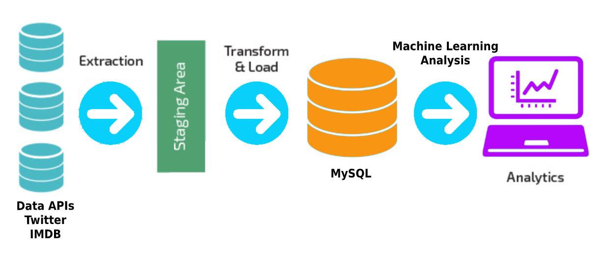
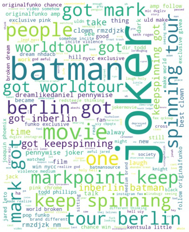

# Extract Transform Load Data Pipelines for sentiment analysis

<p align="center">
  
</p>

-   [Twitter feed ETL sentiment analysis based on keyword search.](#data-pipeline-for-sentiment-analysis-of-twitter-feeds)
-   [IMDB movie description sentiment analysis based on movie genre.](#etl-pipeline-for-analysis-of-imdb-movie-descriptions)

## General setup

-   Make sure Python is installed and set up a Python virtualenv. Install all dependencies from `requirements.txt`.

```shell
$ pip install virtualenv
$ virtualenv venv/bin/activate
$ source venv/bin/activate
$ pip install -r requirements.txt
```

## ETL pipeline for sentiment analysis of Twitter feeds based on keywords or user ids

Download tweets with twitter api, load in an MySQL db, and analyze tweet sentiments all in an ETL pipeline.

### Requirements

-   Twitter account and API credentials (Access Token from a Twitter app)
-   MySQL database server

### Setup

-   Add the required `CONSUMER_KEY`, `CONSUMER_SECRET`, `ACCESS_TOKEN`, `ACCESS_TOKEN_SECRET`, `MYSQL_DATABASE`, `MYSQL_TABLE`, and `MYSQL_PASSWORD` to the `twitter_sent_analysis/twitter_configuration.ini` file. (**Warning: `DO NOT UPLOAD THIS CONFIGURATION FILE ONLINE`**)

-   Install MySQL server and set up a database instance to store the downloaded tweets. For example `CREATE DATABASE twitter_db;`

-   Based on the [Twitter documentation](https://developer.twitter.com/en/docs/tweets/data-dictionary/overview/intro-to-tweet-json) online, we create a TABLE with the following sample schema present in `twitter_sent_analysis/sql/TWEETS_BY_KEYWORD_schema.sql` for downloading tweets by keyword. The sample schema for downloading tweets by userid are present in `twitter_sent_analysis/sql/TWEETS_BY_USERID_schema.sql`:

```sql
CREATE TABLE TWEETS_BY_KEYWORD (
    ID INT AUTO_INCREMENT,
    tweet_id VARCHAR(255) NOT NULL,
    tweet TEXT NOT NULL,
    created_at VARCHAR(50),
    tweet_place VARCHAR(255),     /* Nullable object */
    favorite_count INT(11),       /* Nullable object */
    retweet_count INT(11) NOT NULL,
    reply_count INT(11) NOT NULL,

    user_name VARCHAR(255) NOT NULL,
    user_location VARCHAR(255),   /* Nullable object */
    user_followers_count INT(11) NOT NULL,
    user_friends_count INT(11) NOT NULL,
    PRIMARY KEY (ID)
);
```

-   The table creation SQL command can loaded into `twitterdb` using:

```shell
$ mysql -u root -p twitter_db < TWEETS_BY_KEYWORD_schema.sql;
$ mysql -u root -p twitter_db < TWEETS_BY_USERID_schema.sql;
```

### Run

### 1. To download latest tweets based on keyword or userid search

Make sure the `MYSQL_TABLE` is set to the correct table for the `download_type`. i.e. For downloading using keyword filters, inside `twitter_configuration.ini`, set `TABLE` to `TWEETS_BY_KEYWORD` or the relevant table.

From inside the `twitter_sent_analysis` directory, run:

```shell
$ python download_tweets_data_to_mysql.py download_type filename
```

**Note:**

`download_type` can be set to `keyword` or `userid`.

`filename` should be a file containing keywords/userids in each line seperated by newline chars. (see `inputs/keywords.txt`)

**Example:**

-   To download latest tweets based on keywords from `inputs/keywords.txt`:

```shell
$ python download_tweets_data_to_mysql.py keyword inputs/keywords.txt
```

-   To download latest tweets based on userids from `inputs/userids.txt`:

```shell
$ python download_tweets_data_to_mysql.py userid inputs/userids.txt
```

### 2. To run the sentiment analysis on the downloaded tweets from the MySQL database

##### Cleaning the Tweet data

Preprocessing steps for Natural Language Processing

1.  **Normalization** Convert all words to lowercase. Remove single chars which do not give much information

2.  **Removing extraneous information** Remove stop words (i, the, a, an, nltk library has a decent list), punctuation, diacritical marks, and HTML

3.  **Tokenization** Convert text into tokens using TextBlob

4.  **Lemmatisation** Convert words to their canonical form (i.e. eating and ate to eat)

5.  **Term Frequency-Inverse Document Frequency (TF-IDF)** Checking importance of words based on Frequency across main document or other multiple documents

We pass our pre-processed text into the TextBlob class and run the `sentiment.polarity` method of the object to a get a sentiment scores between -1 and 1 that can be converted to integers -1, 0, or 1 signalling a negative, neutral, or positive sentiment respectively.

##### Generating the wordcloud and sentiment analysis

**Example:**

After the tweet data has been loaded into the MySQL database, the `gen_tweets_sentiment_from_mysql.py` program can be executed to generated the cleaned tweet csv file, sentiment results, and a wordcloud of words based on frequency.

```shell
$ python gen_tweets_sentiment_from_mysql.py
```

**Sample wordcloud from tweets downloaded based on keywords 'batman' and 'joker'.**



## ETL pipeline for analysis of IMDB movie descriptions

### Requirements

-   python dependencies from `requirements.txt`

### Setup

### Run

#### Acknowledgements

-   [Kaggle Competition Sentiment Analysis on Movie Reviews](https://www.kaggle.com/c/sentiment-analysis-on-movie-reviews/)
-   [Daniel Foley](https://www.linkedin.com/in/daniel-foley-1ab904a2/)
